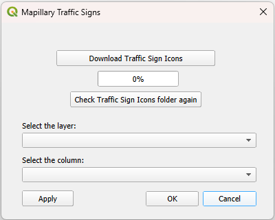

# Mapillary Traffic Sign Icons Import for QGIS Alpha 0.1.0

> **Note:** This is *not* an official plugin by Mapillary, nor is it affiliated in any way with Mapillary.

The **Mapillary Traffic Signs QGIS plugin** provides an easy workflow for visualizing traffic sign data sourced from [mapillary.com](https://www.mapillary.com/) using the official Mapillary icons. After downloading the icon package using the download button within the plugin, you can select a vector layer, choose the classification column provided by your Mapillary dataset, and the plugin will automatically set up SVG marker symbology with your local icons—*no manual path setup necessary*.

**Note:** This plugin only works with data that includes a column classifying the traffic signs using the classification scheme by Mapillary.

## Installation

### Activation
Once installed, the plugin can be activated or deactivated using "Manage and Install Plugins" in QGIS.

The plugin does **not** come with the Mapillary traffic sign icons included—icons must be downloaded after installation.

You can download the `.svg` icon set using the **"Download Traffic Sign Icons"** button. Alternatively, use the **"Check Traffic Sign Folder again"** button to verify if the icons have already been downloaded.

If the icons are available, select the vector layer in your QGIS project that contains the traffic sign data points. Then, select the column that contains the traffic sign classification used by Mapillary.

Pressing the **"Apply"** button will set the symbol of each feature to the respective traffic sign icon.

---
